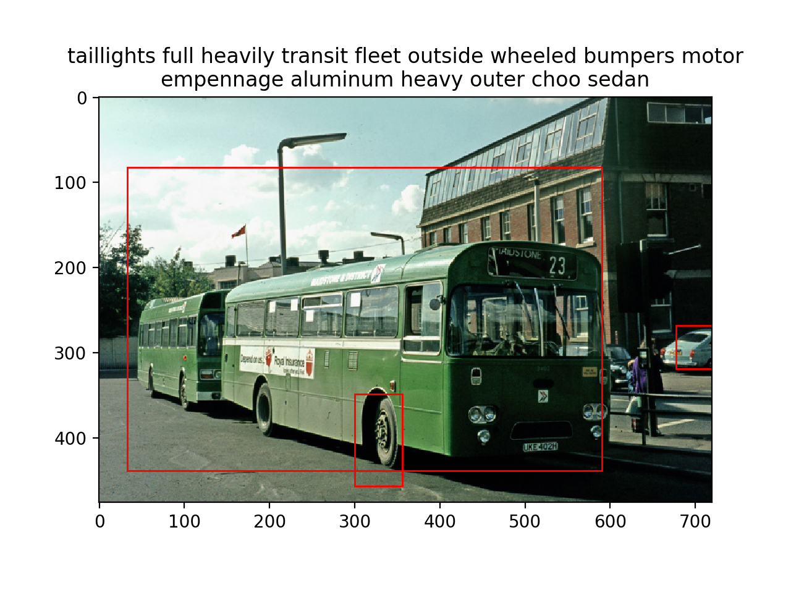

# Redefine the Diversity of Image Captioning

## Installation
### Torch7
We use [DenseCap](https://github.com/jcjohnson/densecap) as our feature extractor, which was implemented in [Torch](http://torch.ch/), and depends on the following packages: [torch/torch7](https://github.com/torch/torch7), [torch/nn](https://github.com/torch/nn), [torch/nngraph](https://github.com/torch/nngraph), [torch/image](https://github.com/torch/image), [lua-cjson](https://luarocks.org/modules/luarocks/lua-cjson), [qassemoquab/stnbhwd](https://github.com/qassemoquab/stnbhwd), [jcjohnson/torch-rnn](https://github.com/jcjohnson/torch-rnn)
After installing torch, you can install / update these dependencies by running the following:

```bash
luarocks install torch
luarocks install nn
luarocks install image
luarocks install lua-cjson
luarocks install https://raw.githubusercontent.com/qassemoquab/stnbhwd/master/stnbhwd-scm-1.rockspec
luarocks install https://raw.githubusercontent.com/jcjohnson/torch-rnn/master/torch-rnn-scm-1.rockspec
luarocks install cutorch
luarocks install cunn
luarocks install cudnn
```
### Pytorch
The LSTM encoder, LSTM decoder and language model are implemented in [Pytorch](https://pytorch.org/get-started/locally/). Please follow the install instructions on official website.  

## Pretrained model
### LSTM Encoder
A pretrained LSTM encoder can be found in [here](https://drive.google.com/file/d/1OFbXUjr9SNc2mGP2YGFdKbr3jiV5uf1w/view?usp=sharing)

If you want to pretrain an LSTM encoder by yourself, please follow instructions in [Pretrain LSTM encoder](#pretrain-lstm-encoder).

### LSTM Decoder
We also provide a pretrained LSTM decoder [here](https://drive.google.com/open?id=1FumbUN5Br8lkGhRoLlapHuQpaFHIjlxK)

To train an LSTM decoder by yourself, please follow instructions in [Train LSTM decoder](#train-lstm-decoder)

## Dataset
To prepare the image dataset, please follow the following steps:
1. Download the raw images and region descriptions from [the Visual Genome website](https://visualgenome.org/api/v0/api_home.html)
2. Use the script `densecap/preprocess.py` to generate a single HDF5 file containing the entire dataset (\~135GB). 
   [(details here)](https://github.com/jcjohnson/densecap/blob/master/doc/FLAGS.md#preprocesspy)

## Vocabulary data
Our LSTM encoder and decoder used shared vocabulary data containing a word dictionary (mapping from word to index) and a word embedding (mapping from index to embedding). We pack the two into one pickle file. Please download the pickle file from [here](https://drive.google.com/open?id=1Kdn8zhTKcYjlkD_UPXCalCfTOXULh_jH) and save them to `./data` folder. 

## Pretrain LSTM encoder
To train a LSTM encoder, we need to first run the feature extractor implemented in Torch at background. 
```bash
cd densecap/
th ft_extractor.lua -checkpoint_start_from ./data/models/densecap/densecap-pretrained-vgg16.t7 -gpu gpu_id &
cd ..
```
Then run LSTM encoder pretraining script:
```bash

python3 pretrain_encoder.py -s save_path
```

## Train LSTM decoder
To train LSTM decoder we also need to first run the feature extractor implemented in Torch at background. 
```bash
cd densecap/
th ft_extractor.lua -checkpoint_start_from ./data/models/densecap/densecap-pretrained-vgg16.t7 -gpu gpu_id &
cd ..
```
Then run LSTM decoder training script:
```bash
python3 train_decoder.py -p path_to_pretrained_lstm_encoder -s save_path
```

## Run demo
To run demo, first run a feature extractor at background:
```bash
cd densecap/
th ft_extractor_demo.lua -checkpoint_start_from ./data/models/densecap/densecap-pretrained-vgg16.t7 -gpu gpu_id &
cd ..
```
Then run `demo.py`:
```bash
python3 demo.py -p path_to_trained_lstm_decoder -i image_path -n number_of_boxes
```
An example output:



